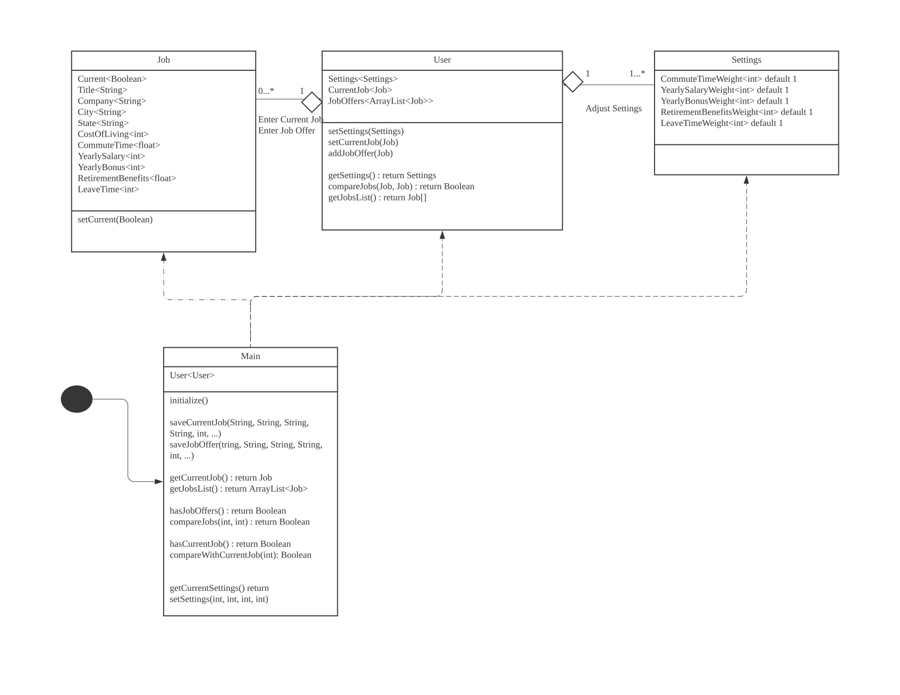
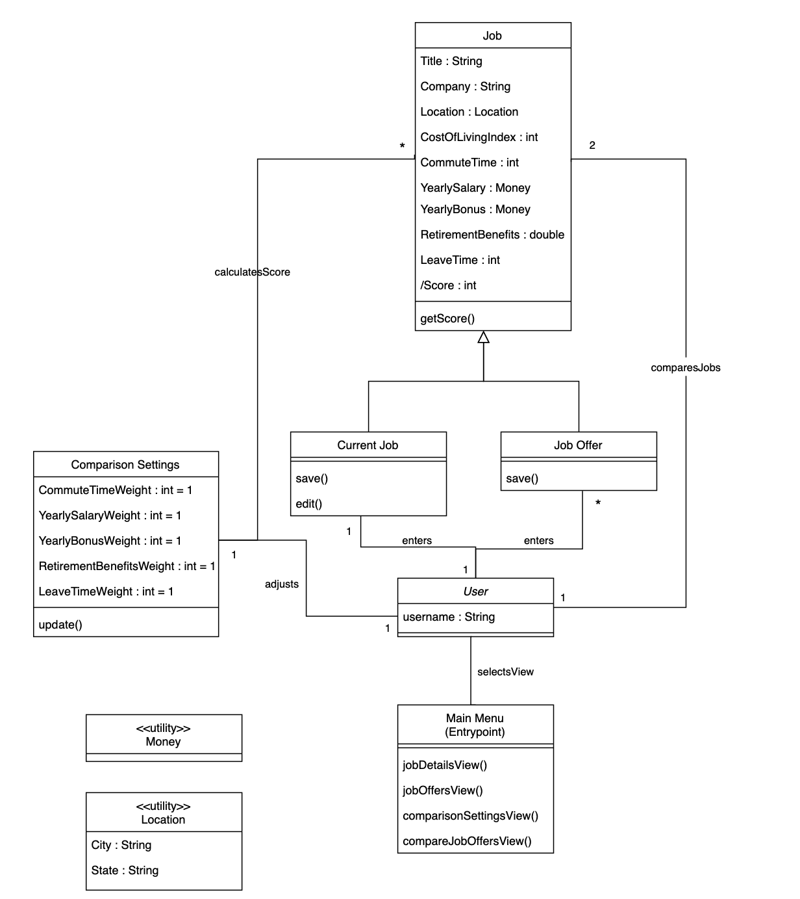
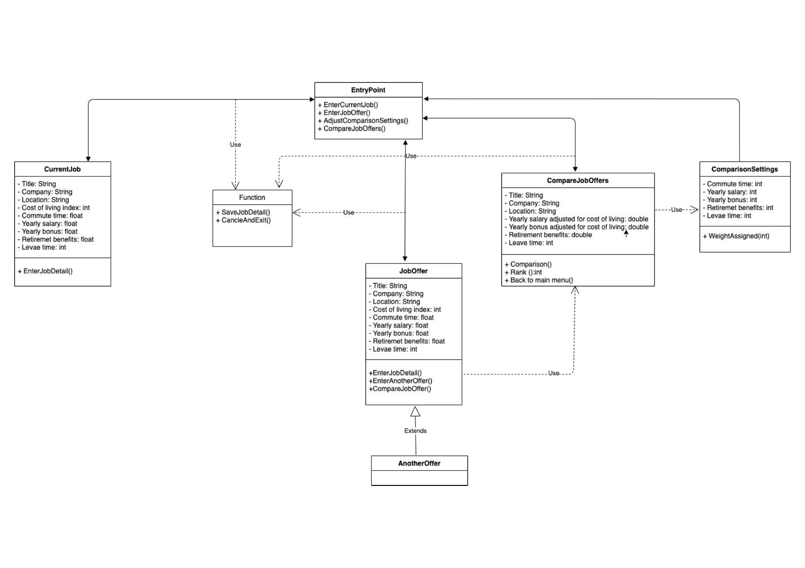
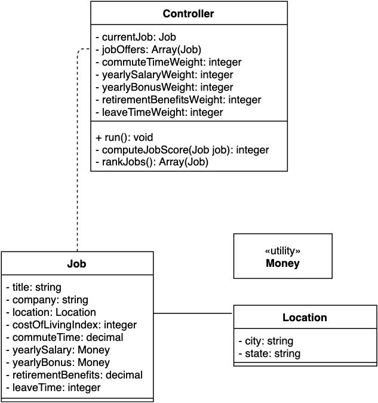
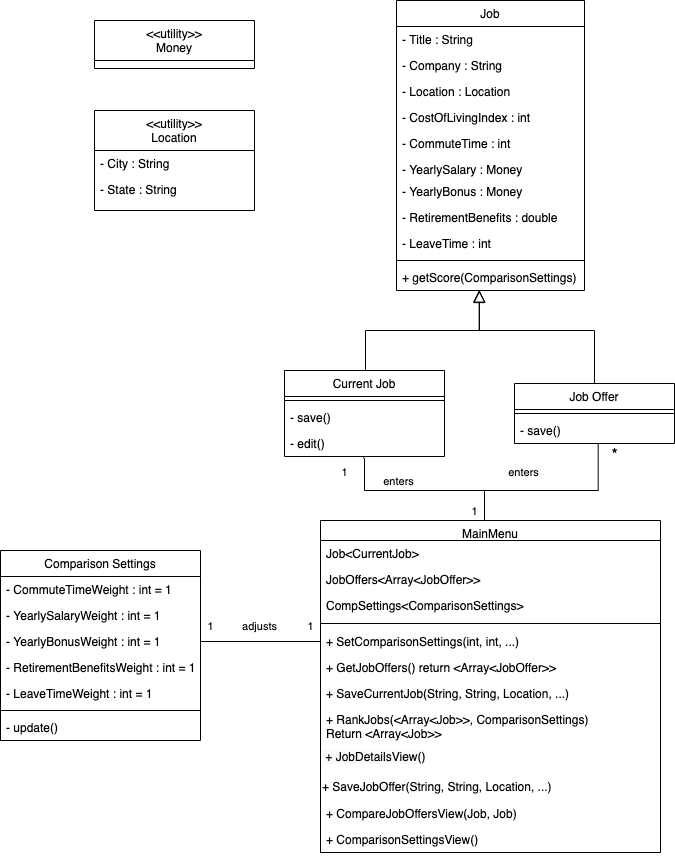

# Team Design Discussion
## Table of contents

1. [Design 1 - tngo62](#design-1---tngo62)
2. [Design 2 - daromando3](#design-2---daromando3)
3. [Design 3 - adelixiati3](#design-3---adelixiati3)
4. [Design 4 - jschaible3](#design-4---jschaible3)
5. [Team Design](#team-design)
5. [Summary](#summary)

## Design 1 - tngo62

- Pros
    - Main method makes a lot of sense for talking to UI
	- Does everything required
- Cons
    - Duplicate functionality on User and Main class
	- Need Location class
	- Need to rank all jobs
	- The design allows user to have multiple current jobs

## Design 2 - daromando3

- Pros
    - captured everything in requirements
    - entrypoint class is a good idea
- Cons
    - Main menu class could directly talk to all other classes
    - Could combine main menu and user
    - Calculate score class could be a main function

## Design 3 - adelixiati3

- Pros
    - Entry point class make sense for the design, provide a main class to connect all the other classes
    - CompareJobOffers class is good to compare current job and job offers. 
- Cons
    -  The attribute in CompareJob offer class has same value in JobOffer class 
    - CompareJob class is not clear how to connect the current job class
    - Compare job function is not clear on how to select two job offers and compare. 

## Design 4 - jschaible3

- Pros
    - Simplicity of sharing Job class for current job and job offers
	- Has required job rankings and comparisons
	- Location as class – but should be a utility class
- Cons
    - Current job and job offer should be child classes of Job parent class
	- Weight settings stored in Controller class should be in separate configuration class with methods to update weight settings
	- Entry point unclear/needs specific entry point

## Team Design

#### Team Design vs Design 1
- Commonalities
    - Both designs have the Main class which acts as entry point to the system and provide methods that could be called by the UI
    - Both have Comparison Settings class with update method and initialized with equal weights
    - Both store Current Job, Job Offers and Comparison Settings 
    - Implementation for Job class looks pretty similar
- Differences
    - While Design 1 uses an instance variable Current to differentiate between Current Job and Job Offer, Team Design uses two separate subclass for this. This is more readable and make it possible to control that only one current job is possible (use Singleton class)
    - While Design 1 has a User class, this class was pretty redundant as there is only 1 user in this project scope. Team Design merges the Main class and User class into MainMenu class.
    - Team Design adds some missing details from Design 1: Implement Location class, Money class, Rank method

#### Team Design vs Design 2
- Commonalities
    - The Job class and Job subclasses are almost identical in the final design and design 2. 
    - Both designs have a Comparison Settings class to store the comparison settings for the jobs.
    - Each design has a utility class for both Money and Location
- Differences
    - The Team design has a Main Menu class, as opposed to a user class and entrypoint/Main menu class in design 2
    - The Team design has variables in the Main menu which hold state for current jobs, Job offers and Comparison settings, while design 2 did not have these objects stored.
    

#### Team Design vs Design 3
- Commonalities
    - Both designs have considered to create a main class to be an entry point to connect with all the other classes. 

    - Both designs have considered to create a job class as super class and extend job offer from it

- Differences
    - The final team design main class has more functionality compare to design 3. There will be less classes to maintain at final design and achieve more goals with one main class. 
    - Team design have Current Job also extend from this super class instead of creating a separate current job class. Current job and job offers share similar attribute and it make sense to extend all from just on super class.
    - The team design has two convenient utility class to store the money and location so it can be shared by all the other classes. 
    - There is no Compare job offer class exist in team design as compare to design 3. Because all the attribute stored in this class are already exist in job class. And all the functions of this class have been captured by main class. So, team design makes much more sense with less classes.

#### Team Design vs Design 4
- Commonalities
    - Both designs have a main class that controls the functionality of the program. In both designs, this class has attributes for Current Job and a list of Job Offers, and also operations for ranking and comparing jobs.
    - Both designs have a Job class with a list of attributes that fulfill the requirements and an operation that calculates the job score.
    - Both designs have a Money utility class for representing salaries and bonuses.
    - Both designs have a Location class that allows to store the City and State of the job.

- Differences
    - The Team Design has Comparison Settings as its own class whereas Design 4 had them as attributes of the Controller class. In the Team Design, Main Menu has an attribute that is an instance of the Comparison Settings class. This change simplifies the Main Menu class and keeps all comparison settings together.
    - The Team Design has child classes Current Job and Job Offer that extend Job and have their own operations.
    - The Team Design has Location as a utility class.

## Summary

#### Lessons Learned
    
The design discussion process went smoothly for our team. Each team member has the chance to talk about his or her design in front of the whole team and the rest of the team members shared their opinions about this design. Everyone learned something during this process. We all agreed that there should some Main class exist to do the core functionality of the app, and to interact with each job class. And we have also agreed that Current job detail and job offer can be extended from a super job class so the attribute can be managed by just on super class. 

Even though there are time differences due to the location between team members, we have managed to find a common time period which work for the whole team. 

Everyone is quick in response to the email and team message so that we can finalize the team design and discussion in a short time.

We had a discussion regarding whether it was necessary to have a User class to support different user profiles, because half of our individual designs had one. We decided as a group that this functionality was unnecessary to satisfy the requirements, so we eliminated it from our final team design to simplify the program structure.

It's interesting to see how the same functionalities could be implemented in so many different ways. Eventually having verbose class does seem to help communicate and understand the system better than having all functions implemented standalone or in main class

